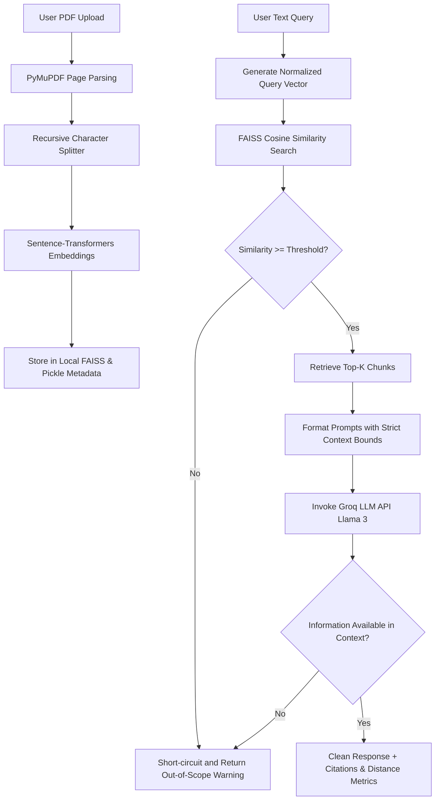

# PDF RAG Chatbot

A modern, high-performance Retrieval-Augmented Generation (RAG) application with a split architecture: a **FastAPI backend** (using FAISS, Sentence Transformers, and Groq Cloud API) and a **sleek responsive HTML/CSS/JS frontend**. This project allows users to upload a PDF document, automatically chunks and embeds the content, stores it in a local vector database, and lets users ask questions strictly related to the PDF with real-time similarity metrics and page citations.

---

## Directory Structure

```text
pdf-rag-chatbot/
├── backend/                  # FastAPI Backend Server
│   ├── app/
│   │   ├── api/              # Upload and Chat endpoints
│   │   ├── core/             # App configs (.env loader)
│   │   ├── models/           # Pydantic schemas
│   │   ├── services/         # PDF parser, embedding, vector search, LLM, and RAG logic
│   │   └── utils/            # Recursive character chunking
│   ├── main.py               # Main API application entry point (with CORS enabled)
│   ├── requirements.txt      # Backend Python dependencies
│   ├── pyproject.toml
│   └── .env                  # Configuration variables (keys, thresholds)
│
├── frontend/                 # Interactive SPA Client
│   ├── index.html            # Sidebar and chat views
│   ├── style.css             # Premium custom dark-mode styling
│   └── app.js                # XHR upload progress tracker & API handler
```

---

## Technology Stack

### Backend
- **Framework**: FastAPI (Python >= 3.11)
- **Vector Search**: FAISS (Facebook AI Similarity Search)
- **Embeddings**: Sentence-Transformers (`all-MiniLM-L6-v2`)
- **LLM API Provider**: Groq SDK
- **PDF Parser**: PyMuPDF (`fitz`)
- **Text Chunking**: LangChain Text Splitters

### Frontend
- **Structure**: Vanilla HTML5 (semantic elements)
- **Styling**: Vanilla CSS3 (custom variables, glassmorphism, flexbox/grid layout, responsive design)
- **Icons**: FontAwesome v6
- **Fonts**: Google Fonts (Outfit)
- **Logic**: Vanilla ES6 JavaScript (includes real-time XHR upload progress tracking)

---

## Setup & Running

### 1. Start the Backend

1. Navigate to the backend directory:
   ```bash
   cd backend
   ```
2. Create a virtual environment and install the dependencies:
   ```bash
   python -m venv .venv
   source .venv/bin/activate  # On Windows: .venv\Scripts\activate
   pip install -r requirements.txt
   ```
3. Create a `.env` file in the `backend` directory (if it does not exist) and configure your keys and thresholds:
   ```env
   GROQ_API_KEY=your_groq_api_key_here
   EMBEDDING_MODEL_NAME=all-MiniLM-L6-v2
   SIMILARITY_THRESHOLD=0.2
   LLM_MODEL=llama-3.1-8b-instant
   LLM_TEMPERATURE=0.7
   VECTOR_SEARCH_TOP_K=5
   CHUNK_SIZE=500
   CHUNK_OVERLAP=100
   ```
4. Start the backend ASGI server:
   ```bash
   uvicorn main:app --reload
   ```
   The backend interactive documentation will be available at **http://127.0.0.1:8000/docs**.

---

### 2. Start the Frontend

CORS (Cross-Origin Resource Sharing) is enabled on the FastAPI backend, allowing the frontend to communicate with it dynamically.

To open the user interface, you have two options:

#### Option A: Direct File Opening (No setup required)
1. Open your File Explorer and navigate to the `frontend/` directory.
2. Double-click the **`index.html`** file (or right-click and select **Open with** > your preferred web browser like Chrome, Firefox, Edge, etc.).

#### Option B: Running a Local Dev Server (Recommended)
Running through an HTTP server avoids potential browser restrictions related to loading files via the `file://` protocol. Open a terminal and choose **one** of the following tools:

- **Using Python (built-in)**:
  ```bash
  cd frontend
  python -m http.server 8080
  ```
  Then visit: **[http://localhost:8080](http://localhost:8080)** in your browser.

- **Using Node.js / npx**:
  ```bash
  cd frontend
  npx http-server -p 8080
  ```
  Then visit: **[http://localhost:8080](http://localhost:8080)** in your browser.

- **Using VS Code Live Server Extension**:
  If you use Visual Studio Code, right-click `frontend/index.html` and click **"Open with Live Server"**.

---

## API Endpoints & Demo Payloads

### 1. Get Backend Configurations
Used by the frontend client to dynamically fetch configuration parameters and prevent hardcoded parameters in the user interface.

* **Endpoint**: `GET http://127.0.0.1:8000/config`
* **Response Payload**:
  ```json
  {
    "similarity_threshold": 0.2,
    "top_k": 5,
    "llm_model": "llama-3.1-8b-instant",
    "embedding_model": "all-MiniLM-L6-v2",
    "chunk_size": 500,
    "chunk_overlap": 100
  }
  ```

---

### 2. Upload PDF
Uploads and indexes a PDF.

* **Endpoint**: `POST http://127.0.0.1:8000/upload`
* **Content-Type**: `multipart/form-data`
* **Response Payload**:
  ```json
  {
    "message": "PDF uploaded successfully.",
    "filename": "annual_report.pdf",
    "total_pages": 12,
    "total_chunks": 48,
    "total_embeddings": 48,
    "session_id": "4cf1b9bb-8647-4959-ba18-e3bc66ab5cf7"
  }
  ```

---

### 2. Chat with PDF
Query the chatbot on content from the uploaded PDF document. Keeps conversation history using the `session_id`.

* **Endpoint**: `POST http://127.0.0.1:8000/chat`
* **Content-Type**: `application/json`
* **Request Payload**:
  ```json
  {
    "query": "What were the total profits in 2025?",
    "session_id": "4cf1b9bb-8647-4959-ba18-e3bc66ab5cf7"
  }
  ```

#### Demo Response (Within Scope):
```json
{
  "answer": "According to the annual report, the total profits in 2025 were $4.2 million, showing a 15% increase compared to 2024.",
  "sources": [
    {
      "page": 3,
      "text": "Financial Summary: Net profits for the fiscal year ending 2025 rose to $4.2 million from $3.65 million in 2024...",
      "similarity_score": 0.7845,
      "cosine_distance": 0.2155
    },
    {
      "page": 4,
      "text": "Profit margins in 2025 stabilized due to strong product uptake...",
      "similarity_score": 0.6512,
      "cosine_distance": 0.3488
    }
  ],
  "session_id": "4cf1b9bb-8647-4959-ba18-e3bc66ab5cf7"
}
```

#### Demo Response (Out of Scope / Empty Vector DB):
```json
{
  "answer": "This question is outside the scope of the uploaded document. Please ask questions related to the uploaded PDF only.",
  "sources": [],
  "session_id": "4cf1b9bb-8647-4959-ba18-e3bc66ab5cf7"
}
```

---

## Core RAG Pipeline Architecture

Below is the technical workflow representing how files are indexed and user queries are validated for accuracy:



1. **Embedding Normalization**: All vectors generated by `all-MiniLM-L6-v2` are normalized to unit length ($L_2$ norm = 1.0). This allows the dot product search in FAISS to represent a true Cosine Similarity metric.
2. **Double-layer Filtering**:
   - **Database Layer**: If the similarity search returns 0 elements above the `SIMILARITY_THRESHOLD` configured in `.env` (default is `0.2`), the system triggers the custom out-of-scope response without hitting the LLM, preserving API quota.
   - **LLM Synthesis Layer**: If the chunks pass the vector database filter but the context does not contain the answer, the LLM system prompt restricts it from hallucinating external information and forces it to return the exact out-of-scope message.
3. **CORS Enabled**: The FastAPI backend includes full CORS middleware coverage so that the frontend SPA client can request resources securely over localhost.
